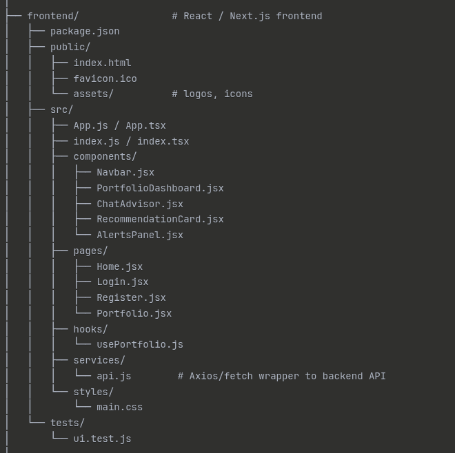
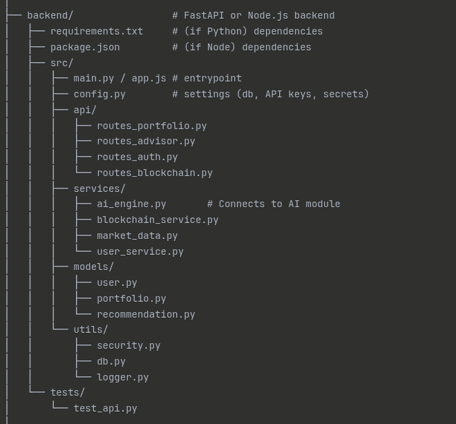
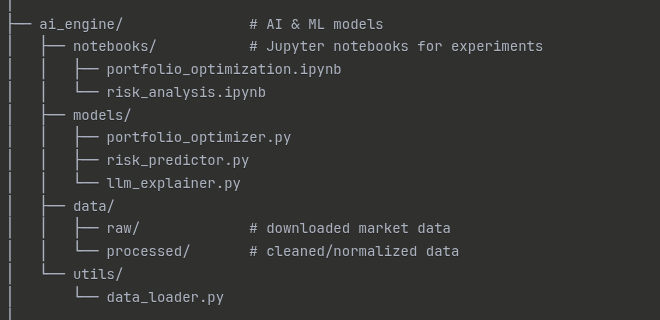
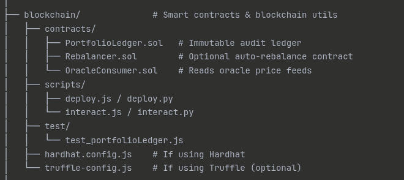
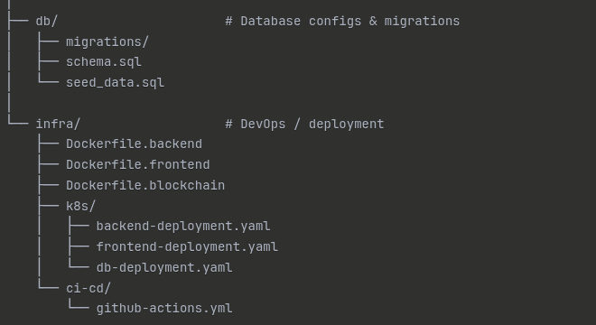

# AI-Based Investment Advisor with Blockchain

🚀 An intelligent financial advisor designed for middle-class families.  
Provides **smart portfolio tracking, AI-driven recommendations**, and an **immutable blockchain-based audit trail** for trust & transparency.

---

## ✨ Features
- 📊 Portfolio tracking (stocks, crypto, mutual funds)
- 🤖 AI-powered recommendations (risk-adjusted optimization, explainable advice)
- 🔗 Blockchain audit trail (immutable logs of recommendations & trades)
- 📱 Simple UI (web & mobile-friendly dashboard)
- 🔒 Security-first (encrypted DB, optional non-custodial wallets)
- 🧪 Backtesting & simulation before deploying strategies

---

## 🏗️ Architecture
- **Frontend**: React (dashboard + advisor chat)

- **Backend**: FastAPI / Node.js (API orchestration)

- **AI Engine**: ML + RL models + LLM explanations

- **Blockchain**: Solidity smart contracts (audit ledger, optional rebalancer)

- **Database**: PostgreSQL (encrypted columns)
- **Oracles**: Chainlink (price feeds)
- **Infra**: Docker, Kubernetes, GitHub Actions

See `docs/ARCHITECTURE.md` for a detailed diagram.

---

## 📂 Project Structure

# AI Investment Advisor - Project Structure

| Path | Type | Description |
|------|------|-------------|
| **ai-investment-advisor/** | Directory | Root project directory |
| ├── README.md | File | Main project overview, features, setup guide |
| ├── LICENSE | File | Open-source license (MIT/Apache 2.0 recommended) |
| ├── .gitignore | File | Ignore venv, node_modules, build files |
| ├── docker-compose.yml | File | For running backend + db + blockchain local node |
| ├── .env.example | File | Template for environment variables |
| **├── docs/** | Directory | Documentation & architecture |
| │   ├── ARCHITECTURE.md | File | High-level architecture diagram + explanation |
| │   ├── AI_MODELS.md | File | Notes about ML/AI models used |
| │   ├── BLOCKCHAIN.md | File | Smart contract architecture + flow |
| │   ├── SECURITY.md | File | Key management, KYC/AML notes |
| │   ├── DATA_PIPELINE.md | File | Data ingestion & processing notes |
| │   └── ROADMAP.md | File | Development roadmap (MVP → full system) |
| **├── frontend/** | Directory | React / Next.js frontend |
| │   ├── package.json | File | Frontend dependencies |
| │   **├── public/** | Directory | Public assets |
| │   │   ├── index.html | File | Main HTML file |
| │   │   ├── favicon.ico | File | Site favicon |
| │   │   └── assets/ | Directory | Logos, icons |
| │   **├── src/** | Directory | Frontend source code |
| │   │   ├── App.js / App.tsx | File | Main application component |
| │   │   ├── index.js / index.tsx | File | Application entry point |
| │   │   **├── components/** | Directory | Reusable UI components |
| │   │   │   ├── Navbar.jsx | File | Navigation bar component |
| │   │   │   ├── PortfolioDashboard.jsx | File | Portfolio dashboard view |
| │   │   │   ├── ChatAdvisor.jsx | File | AI chat interface |
| │   │   │   ├── RecommendationCard.jsx | File | Investment recommendation display |
| │   │   │   └── AlertsPanel.jsx | File | Alerts and notifications panel |
| │   │   **├── pages/** | Directory | Page components |
| │   │   │   ├── Home.jsx | File | Home page |
| │   │   │   ├── Login.jsx | File | Login page |
| │   │   │   ├── Register.jsx | File | Registration page |
| │   │   │   └── Portfolio.jsx | File | Portfolio page |
| │   │   **├── hooks/** | Directory | Custom React hooks |
| │   │   │   └── usePortfolio.js | File | Portfolio data management hook |
| │   │   **├── services/** | Directory | API and external services |
| │   │   │   └── api.js | File | Axios/fetch wrapper to backend API |
| │   │   **└── styles/** | Directory | Styling files |
| │   │       └── main.css | File | Main stylesheet |
| │   **└── tests/** | Directory | Frontend tests |
| │       └── ui.test.js | File | UI component tests |
| **├── backend/** | Directory | FastAPI or Node.js backend |
| │   ├── requirements.txt | File | Python dependencies |
| │   ├── package.json | File | Node.js dependencies |
| │   **├── src/** | Directory | Backend source code |
| │   │   ├── main.py / app.js | File | Application entry point |
| │   │   ├── config.py | File | Settings (db, API keys, secrets) |
| │   │   **├── api/** | Directory | API route handlers |
| │   │   │   ├── routes_portfolio.py | File | Portfolio management endpoints |
| │   │   │   ├── routes_advisor.py | File | AI advisor endpoints |
| │   │   │   ├── routes_auth.py | File | Authentication endpoints |
| │   │   │   └── routes_blockchain.py | File | Blockchain integration endpoints |
| │   │   **├── services/** | Directory | Business logic layer |
| │   │   │   ├── ai_engine.py | File | Connects to AI module |
| │   │   │   ├── blockchain_service.py | File | Blockchain interaction service |
| │   │   │   ├── market_data.py | File | Market data fetching service |
| │   │   │   └── user_service.py | File | User management service |
| │   │   **├── models/** | Directory | Data models |
| │   │   │   ├── user.py | File | User model |
| │   │   │   ├── portfolio.py | File | Portfolio model |
| │   │   │   └── recommendation.py | File | Recommendation model |
| │   │   **└── utils/** | Directory | Utility functions |
| │   │       ├── security.py | File | Security utilities |
| │   │       ├── db.py | File | Database utilities |
| │   │       └── logger.py | File | Logging configuration |
| │   **└── tests/** | Directory | Backend tests |
| │       └── test_api.py | File | API endpoint tests |
| **├── ai_engine/** | Directory | AI & ML models |
| │   **├── notebooks/** | Directory | Jupyter notebooks for experiments |
| │   │   ├── portfolio_optimization.ipynb | File | Portfolio optimization experiments |
| │   │   └── risk_analysis.ipynb | File | Risk analysis experiments |
| │   **├── models/** | Directory | ML model implementations |
| │   │   ├── portfolio_optimizer.py | File | Portfolio optimization model |
| │   │   ├── risk_predictor.py | File | Risk prediction model |
| │   │   └── llm_explainer.py | File | LLM-based explanation generator |
| │   **├── data/** | Directory | Training and processed data |
| │   │   ├── raw/ | Directory | Downloaded market data |
| │   │   └── processed/ | Directory | Cleaned/normalized data |
| │   **└── utils/** | Directory | AI utilities |
| │       └── data_loader.py | File | Data loading utilities |
| **├── blockchain/** | Directory | Smart contracts & blockchain utilities |
| │   **├── contracts/** | Directory | Solidity smart contracts |
| │   │   ├── PortfolioLedger.sol | File | Immutable audit ledger |
| │   │   ├── Rebalancer.sol | File | Optional auto-rebalance contract |
| │   │   └── OracleConsumer.sol | File | Reads oracle price feeds |
| │   **├── scripts/** | Directory | Deployment and interaction scripts |
| │   │   ├── deploy.js / deploy.py | File | Contract deployment script |
| │   │   └── interact.js / interact.py | File | Contract interaction script |
| │   **├── test/** | Directory | Smart contract tests |
| │   │   └── test_portfolioLedger.js | File | Portfolio ledger tests |
| │   ├── hardhat.config.js | File | Hardhat configuration |
| │   └── truffle-config.js | File | Truffle configuration (optional) |
| **├── db/** | Directory | Database configurations & migrations |
| │   ├── migrations/ | Directory | Database migration files |
| │   ├── schema.sql | File | Database schema definition |
| │   └── seed_data.sql | File | Seed data for development |
| **└── infra/** | Directory | DevOps / deployment |
|     ├── Dockerfile.backend | File | Backend Docker configuration |
|     ├── Dockerfile.frontend | File | Frontend Docker configuration |
|     ├── Dockerfile.blockchain | File | Blockchain node Docker configuration |
|     **├── k8s/** | Directory | Kubernetes configurations |
|     │   ├── backend-deployment.yaml | File | Backend K8s deployment |
|     │   ├── frontend-deployment.yaml | File | Frontend K8s deployment |
|     │   └── db-deployment.yaml | File | Database K8s deployment |
|     **└── ci-cd/** | Directory | CI/CD configurations |
|         └── github-actions.yml | File | GitHub Actions workflow |

## ⚡ Setup
1. Clone repo
2. Setup `.env` (see `.env.example`)
3. Install dependencies (backend & frontend)
4. Run with `docker-compose up`

---

## 🔮 Roadmap
- [x] MVP: Off-chain portfolio tracker + AI suggestions
- [ ] On-chain audit trail (Polygon smart contract)
- [ ] Trade execution (brokers / DEX)
- [ ] Advanced AI (RL-based dynamic strategies)
- [ ] Mobile app

---

## ⚠️ Disclaimer
This project is for **educational purposes only**.  
Not financial advice. Please consult a licensed advisor before making investments.

